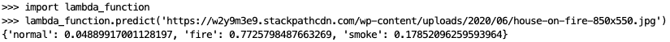
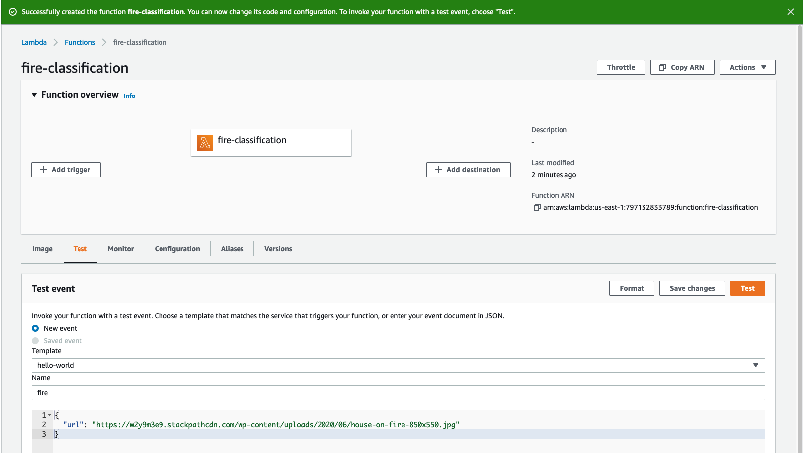

## ML Zoomcamp Capstone Project - December 2021

# Is It on Fire?

                 

## Table of Contents
* [1. Problem Description](#desc)
* [2. Data](#data)
* [3. Setting Up the Data Structure](#data-prep)
* [4. Project Structure](#project-struct)
* [5. Models Used](#models)
* [6. Model Deployment](#model-deployment)

<a id='desc'></a>
## 1. Problem Description
Being able to identify a problem situation early can be beneficial and prevent harm.  With all the video and still footage taken by security cameras we can use these images to train a model to automatically detect (classify) situations where everything is fine, where there is smoke or where there is an actual fire.  This helps us react quicker to potential disasters.

This type of classification could be applied to many topics, such as which kind of microplastic is in the water, land type use, and identifying invasive species.

For testing this project, you can give it an image and it will determine the probability the image is normal, there is a fire or there is smoke.  While you would not want to do that for a lot of images, the idea is that you could build the model with some additional automation to be able to routinely scan images to detect fire.

<a id='data'></a>
## 2. Data
The original data, which includes both still images and video, came from the Fire Detection Dataset by Ritu Pande via Kaggle
https://www.kaggle.com/ritupande/fire-detection-from-cctv.  

This data is taken from closed circuit tv cameras to determine:
  1. things are normal (default) 
  2. things are on fire
  3. smoke is detected

Only the still images were used for this project.  There are 864 still images.  Their size is approximately 32 KB each in 224 x 224.

<a id='data-prep'></a>
## 3. Setting Up the Data Structure
1. Download the data from https://www.kaggle.com/ritupande/fire-detection-from-cctv/download.  I stored this in /original-data.
2. Unzip the archive.zip file.  We do not need the video data for this project.  
3. For some reason, when you unzip the archive.zip file, it creates a recursive directory structure. Copy just the img_data to /data and run 00-prepare-random-sample.py to select a random 20% of the training data to be our validation data.  Or you can just move the images in your file system manually - just make sure there is a set of val directories and they have about 20% of the files in them.


*Note: If you run the 00-prepare-random-sample.py more than once, it will keep moving 20% of the training files to your validation directory.*


<a id='project-struct'></a>
## 4. Project Structure
```
ml-zoomcamp-final
│   README.md - describes the project and how to run it
│   00-prepare-random-sample.py - script to run once to get a sample of 20%
│   ml-zoomcamp-final.ipynb - EDA, parameter tuning, model selection
│   lambda-function.py - script for serverless AWS lambda function
│   train.py - trains a selected model and saves it
│   local-test.py - reads the saved model and tests a prediction
│   predict.py - loads the model and serves it via flask
│   test.py - to test the dockerfile locally
│   Pipfile - which packages and versions you will need for this project
│   Pipefile.lock
│   Dockerfile - to run the service
└───data
│   └───img_data
│       └───test
│       │    └───default
│       │    │   img_102.jpg
│       │    │   ...
│       │    └───fire
│       │    │   img_124.jpg
│       │    │   ...
│       │    └───smoke
│       │    │   img_311.jpg
│       │    │   ...
│       └───train
│       │    └───default
│       │    │   img_1.jpg
│       │    │   ...
│       │    └───fire
│       │    │   img_106.jpg
│       │    │   ...
│       │    └───smoke
│       │    │   img_1015.jpg
│       │    │   ...
│       └───val
│       │    └───default
│       │    │   img_1027.jpg
│       │    │   ...
│       │    └───fire
│       │    │   img_117.jpg
│       │    │   ...
│       │    └───smoke
│       │    │   img_23.jpg
│       │    │   ...
└───images - images used in the readme and jupyter notebooks
└───models - saved models
└───original-data
│       └───archive.zip

```

<a id='models'></a>
## 5. Models Used
As an image classification problem, Neural Nets with different optimizers, learning rates, momentum, dropout rates, numbers of convolutional layers, and numbers of Dense layers were tried.

In addition, transfer learning was applied using [MobileNetV2](https://keras.io/api/applications/mobilenet/) and [Xception](https://keras.io/api/applications/xception/).

<a id='model-deployment'></a>
## 6. Model Deployment

### To Create the Pipfile and Pipfile.lock
```
   pip install --user pipenv
   pipenv install numpy
   pipenv install pandas
   pipenv install requests
   pipenv install scikit-learn==1.0
   pipenv install scikit-image
   pipenv install tensorflow
   pipenv install flask
   pipenv install gunicorn
   pipenv install tensorflow-hub
   pipenv install keras-image-helper
```

### To run train.py
train.py - creates a script from one of the models from our jupyter notebook and coverts the model to tflite.


### To run local-test.py
This just reads a saved model and tests a prediction.


### To test lambda_function.py
To test the script for serverless AWS lambda function:
1. just testing the script



2. testing the lambda_function with an event


*Note: Use ```import tensorflow.lite as tflite``` when testing locally, but switch to ```import tflite_runtime.interpreter as tflite``` for deployment.*

### To run predict.py
To test locally, comment in the url and then run using ```python3 predict.py```.
Comment out the url when getting ready to deploy.

### To build the Dockerfile


### To run the Dockerfile


### To test the Dockerfile locally


### To publish the Dockerfile to Amazon's Elastic Container Registry (ECR)
   1. If you do not already have awscli, install it using ```pip install awscli```
   2. If this is your first time using a repository, you will need to run ```aws configure```.  It will ask you for your AWS Access ID, your AWS Secret Access Key, your default region name, and the default output format you would like to use.  If you do not have the keys, please follow the instructions at https://aws.amazon.com/premiumsupport/knowledge-center/create-access-key/
   3. Name your ECR repository
   ```aws ecr create-repository --repository-name fire-prediction-tflite-images```
   4. You will need to login (we will obfuscate the password and set it as an environment variable)
   5. Execute ```$(aws ecr get-login --no-include-email)```
   6. Tag your latest docker image
   
   7. Push your docker image to ECR  
   ```docker push ${REMOTE_URI}```
   
### To define an AWS Lambda Function

   1. Login to the AWS Console and search for Lambda
   
   2. Create Function
   
   
   
   3. Select Container Image
   
   
   
    You should be able to see your private repository that you just pushed to ECR, select that
    
   
   
   
   
   You should now see your lambda function
   
   
   
   4. Create a test for your lambda function by clicking on the Test tab
   
   
   
   5. Edit your test settings to Memory 1024 MB and 30 seconds for the time out and give your event a name (don't forget to Save)
   
   
   
   
   
   
   
   6. Exposing the Lambda Function
      * From the AWS Console search for API Gateway
   
      
   
      * Select REST API
   
      
   
      * Choose the Protocol
      
      
      
      * Select Actions, then Create Resource from the dropdown 
      
      
      
      * Select Actions, then Create Method from the dropdown
      
      
      
      * Click OK on Add Permission to Lambda Function
      
      * Create a Post Method
      
       
       
      * Click on Test to try running a test
      
      
       
       
   
   
   
  