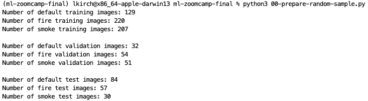

## ML Zoomcamp Capstone Project

## Table of Contents
* [1. Problem Description](#desc)
* [2. Data Set](#dataset)
* [3. Data Preparation](#data-prep)
* [4. Project Structure](#project-struct)
* [5. Models Used](#models)
* [6. Model Deployment](#model-deployment)

<a id='desc'></a>
## 1. Problem Description
Being able to identify a problem situation early can be beneficial and prevent harm.  With all the video and still footage taken by security cameras we can use these images to train a model to automatically detect (classify) situations where everything is fine, where there is smoke or where there is an actual fire.

This type of classification could be applied to many topics, such as which kind of microplastic is in the water, land type use, and identifying invasive species.

For testing this project, you can give it an image and it will determine if it's normal, there's fire or there's smoke.  While you would not want to do that for a lot of images, the idea is that you could build the model with some automation to be able to routinely scan images to detect fire.

<a id='dataset'></a>
## 2. Data Set
The original data came from the Fire Detection Dataset by Ritu Pande from Kaggle
https://www.kaggle.com/ritupande/fire-detection-from-cctv.  There are both still images and video.  Only the still images were used for this project.

This data is taken from closed circuit tv cameras to determine:
  1. things are normal (default) 
  2. things are on fire
  3. smoke is detected

There are 864 still images.  Their size is approximately 32 KB each in 224 x 224.

<a id='data-prep'></a>
## 3. Setting Up the Data Structure
1. Download the data from https://www.kaggle.com/ritupande/fire-detection-from-cctv/download.  I stored this in /original-data.
2. Unzip the archive.zip file.  We do not need the video data for this project.  
3. For some reason, when you unzip the archive.zip file, it creates a recursive directory structure. Copy just the img_data to /data and run 00-prepare-random-sample.py to select a random 20% of the training data to be our validation data.  Or you can just move the images in your file system manually - just make sure there is a set of val directories and they have about 20% of the files in them.


*Note: If you run the 00-prepare-random-sample.py more than once, it will keep moving 20% of the training files to your validation directory.*


<a id='project-struct'></a>
## 4. Project Structure
```
ml-zoomcamp-final
│   README.md - describes the project and how to run it
│   00-prepare-random-sample.py - script to run once to get a sample of 20%
│   ml-zoomcamp-final.ipynb - EDA, parameter tuning, model selection
│   lambda-function.py - script for serverless AWS lambda function
│   train.py - trains a selected model and saves it
│   local-test.py - reads the saved model and tests a prediction
│   predict.py - loads the model and serves it via flask
│   test.py - 
│   Pipfile - which packages and versions you will need for this project
│   Pipefile.lock
│   Dockerfile - to run the service
└───data
│   └───img_data
│       └───test
│       │    └───default
│       │    │   img_102.jpg
│       │    │   ...
│       │    └───fire
│       │    │   img_124.jpg
│       │    │   ...
│       │    └───smoke
│       │    │   img_311.jpg
│       │    │   ...
│       └───train
│       │    └───default
│       │    │   img_1.jpg
│       │    │   ...
│       │    └───fire
│       │    │   img_106.jpg
│       │    │   ...
│       │    └───smoke
│       │    │   img_1015.jpg
│       │    │   ...
│       └───val
│       │    └───default
│       │    │   img_1027.jpg
│       │    │   ...
│       │    └───fire
│       │    │   img_117.jpg
│       │    │   ...
│       │    └───smoke
│       │    │   img_23.jpg
│       │    │   ...
└───images
└───models
└───original-data
│       │    archive.zip

```

<a id='models'></a>
## 5. Models Used
As an image classification problem, Neural Nets with different optimizers, learning rates, momentum, dropout rates, numbers of convolutional layers, and numbers of Dense layers were tried.

In addition, transfer learning was applied using MobileNetV2 and Xception.

<a id='model-deployment'></a>
## 6. Model Deployment

### To Create the Pipfile and Pipfile.lock
```
   pip install --user pipenv
   pipenv install numpy
   pipenv install pandas
   pipenv install requests
   pipenv install scikit-learn==1.0
   pipenv install scikit-image
   pipenv install tensorflow
   pipenv install flask
   pipenv install gunicorn
   pipenv install tensorflow-hub
   pipenv install keras-image-helper
```

### To run train.py
train.py - creates a script from one of the models from our jupyter notebook and coverts the model to tflite.


### To run local-test.py
This just reads a saved model and tests a prediction.


### To test lambda_function.py
To test the script for serverless AWS lambda function:
1. just testing the script

2. now testing the lambda_function with an event


*Note: Use ```import tensorflow.lite as tflite``` when testing locally, but switch to ```import tflite_runtime.interpreter as tflite``` for deployment.*